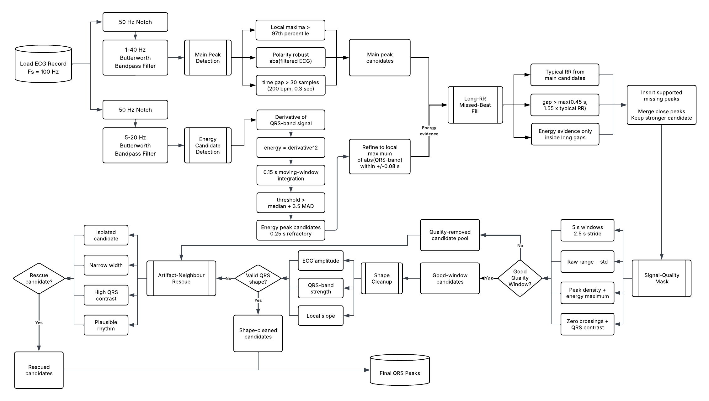
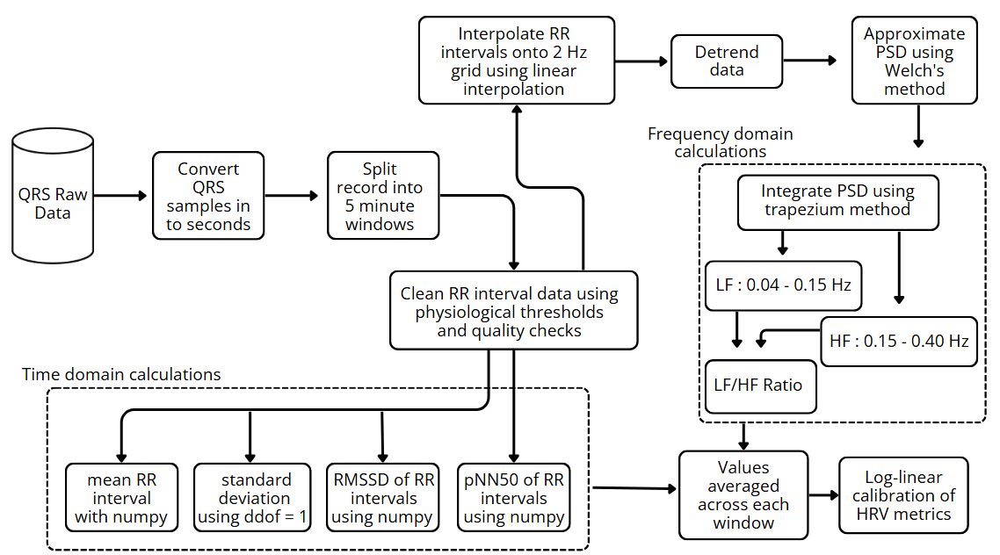

# ECG Detection

## Files

- `qrs_pipeline.py`: final QRS detection pipeline.
- `test.py`: generates QRS predictions and calibrated HRV metrics.
- `processor.py`: fills the MATLAB analysis template using generated QRS and HRV outputs.
- `qrs_debug_viewer.py`: visual inspection helper imported by `test.py`.
- `requirements.txt`: Python dependencies.
- `assets/`: QRS detection and HRV workflow diagrams.

## Dependencies

Install dependencies:

```bash
pip install -r requirements.txt
```

The package uses:

```text
numpy
scipy
matplotlib
pandas
```

## Expected Input Layout

Before running the full pipeline, place the project `.mat` files in a `dataSet/`
folder next to the Python files:

```text
dataSet/
  ProjectTestData.mat
  ProjectTestDataAnalysis.mat
```

`ProjectTestData.mat` is the ECG input file. `ProjectTestDataAnalysis.mat` is
the MATLAB template that will be filled with QRS detections and HRV metrics.

## Run

Generate QRS predictions and calibrated HRV metrics:

```bash
python3 -B test.py --mat dataSet/ProjectTestData.mat --hrv --out-dir outputs/qrs_eval
```

Fill the final MATLAB output file:

```bash
python3 -B processor.py
```

The output file is written to:

```text
dataSet/ProjectTestDataAnalysis_filled.mat
```

## Viewer

To inspect a record visually:

```bash
python3 -B test.py --viz --mat dataSet/ProjectTrainData.mat --patient 17
```

This command requires `ProjectTrainData.mat` if viewing training records.

## Training-Set Performance

Training-set QRS detection performance reproduced from this code using a 50 ms
one-to-one matching tolerance:

| Metric | Value |
| --- | ---: |
| Sensitivity | 99.6443% |
| PPV | 99.6279% |
| F1 | 99.6361% |
| TP | 1,117,064 |
| FP | 4,172 |
| FN | 3,988 |

Training-set HRV performance reproduced from this code:

| HRV metric | MAPE |
| --- | ---: |
| avgRR | 0.261142% |
| sdRR | 2.574766% |
| RMSSD | 6.823154% |
| pNN50 | 11.890269% |
| LF | 12.322023% |
| HF | 18.474738% |
| LF/HF | 11.472152% |
| Average MAPE | 9.116892% |

## Workflow Diagrams

QRS detection workflow:



HRV calculation workflow:



## Pipeline Summary

The active final pipeline is:

1. Load each single-lead ECG record at 100 Hz.
2. Apply 50 Hz notch filtering.
3. Build a broad zero-phase 1-40 Hz ECG signal for morphology-preserving peak
   detection.
4. Build a narrow zero-phase 5-20 Hz QRS-band signal for supporting evidence.
5. Detect high-confidence QRS candidates from the absolute value of the broad
   filtered ECG.
6. Generate derivative-squared QRS-energy candidates and insert them only
   inside rhythm-supported long RR gaps.
7. Apply signal-quality masking to remove dense artifact/noise regions.
8. Use close-peak shape cleanup to keep the stronger candidate when duplicate
   detections occur within one QRS complex.
9. Restore isolated high-confidence QRS candidates near artifact boundaries
   using conservative artifact-neighbor rescue rules.
10. Apply guarded early-negative alignment, adaptive RR cleanup, and weak
    short-RR cleanup to reduce duplicate detections before HRV calculation.
11. Convert final QRS locations to RR intervals, reject physiologically
    implausible RR values, and calculate HRV in non-overlapping 5-minute
    windows.
12. Average valid HRV windows across each record and apply the fixed global
    HRV calibration used for the final submission.
